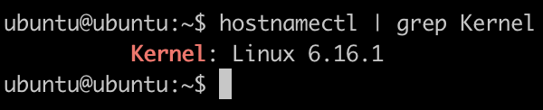
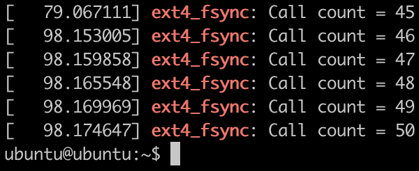

# Step by Step Guide to Install Custom OS Kernel with QEMU on Linux

### Dependencies is really important. The version I use:
1. Ubuntu 22 (Host)
2. Ubuntu 24 (VM)
3. Linux 6.16 (Kernel)

##### This guide assumes you have a running server such as [VirtualBox,](https://www.virtualbox.org/) [Parallels,](https://www.parallels.com/) CloudLab or others. I recommend using [CloudLab.](https://www.cloudlab.us/) Once your server is set up, follow the steps bellow to create a Virtual Machine(VM) and install the kernel.
---

# PART I - Run VM (Ubuntu)
### Update Ubuntu
```
sudo apt update
sudo apt upgrade -y
```

### Install QEMU
```
sudo apt install qemu-system-x86 -y
qemu-system-x86_64 --version
```

### Install Others
```
sudo apt-get install build-essential libncurses-dev flex bison openssl libssl-dev dkms libelf-dev bc
```


### Detail Installation from the Cloud Init Guide
```
mkdir temp
cd temp

wget https://cloud-images.ubuntu.com/noble/current/noble-server-cloudimg-amd64.img
```

```
cat << EOF > user-data
#cloud-config
password: password
chpasswd:
  expire: False

EOF
```

```
cat << EOF > meta-data
instance-id: someid/somehostname

EOF
```

```
touch vendor-data
```

##### We need to open the second terminal and run this
```
cd temp
python3 -m http.server --directory .
```

##### Back to first terminal. Resize the main disk to 20G
```
qemu-img resize noble-server-cloudimg-amd64.img +20G
```

##### Run QEMU
```
qemu-system-x86_64 \
    -net nic \
    -net user \
    -machine accel=kvm \
    -m 10000 \
    -smp 10 \
    -nographic \
    -hda noble-server-cloudimg-amd64.img \
    -smbios type=1,serial=ds='nocloud;s=http://10.0.2.2:8000/'
```
##### Notes
```
login: ubuntu
password: password
```
# PART II - Install Kernel Inside VM

### Install Libraries
##### The same installation as the previous one
```
sudo apt-get install build-essential libncurses-dev flex bison openssl libssl-dev dkms libelf-dev bc
```

### Download Kernel
```
wget https://www.kernel.org/pub/linux/kernel/v6.x/linux-6.16.1.tar.xz
tar xf linux-6.16.1.tar.xz
cd linux-6.16.1
```

### Install Kernel
```
make defconfig
make -j$(nproc)
sudo make modules_install
sudo make install
```

### Reboot and Check Kernel Version
```
sudo reboot
hostnamectl
```

# PART 3 - Make Mini Modification
### Adding a counter in the ext4 File System
##### Update the fsync.c
```
cd linux-6.16.1/
vim fs/ext4/fsync.c
```

##### Add these
```
static unsigned long ext4_fsync_count = 0; // Global counter for fsync calls

int ext4_sync_file(struct file *file, loff_t start, loff_t end, int datasync)
{
    ext4_fsync_count++; // Increment counter
    printk(KERN_INFO "ext4_fsync: Call count = %lu\n", ext4_fsync_count);
    // ... rest of the function remains unchanged
}
```

##### Recompile and Restart
```
make -j$(nproc)
sudo make modules_install
sudo make install
sudo reboot
```

### Check New Kernel Version
```
hostnamectl
```


##### This is the tester file
```
#include <stdio.h>
#include <fcntl.h>
#include <unistd.h>

int main() {
    int fd = open("testfile", O_CREAT | O_WRONLY, 0644);
    if (fd < 0) {
        perror("open");
        return 1;
    }

    for (int i = 0; i < 5; i++) {
        write(fd, "test", 4);
        fsync(fd);
        printf("fsync call %d completed\n", i + 1);
    }

    close(fd);
    return 0;
}
```

##### Compile and run
```
gcc test.c -o test && ./test
```

##### Print the kernel log
```
dmesg | grep ext4_fsync
```


### Resources

```
https://cloudinit.readthedocs.io/en/latest/tutorial/qemu.html
```
